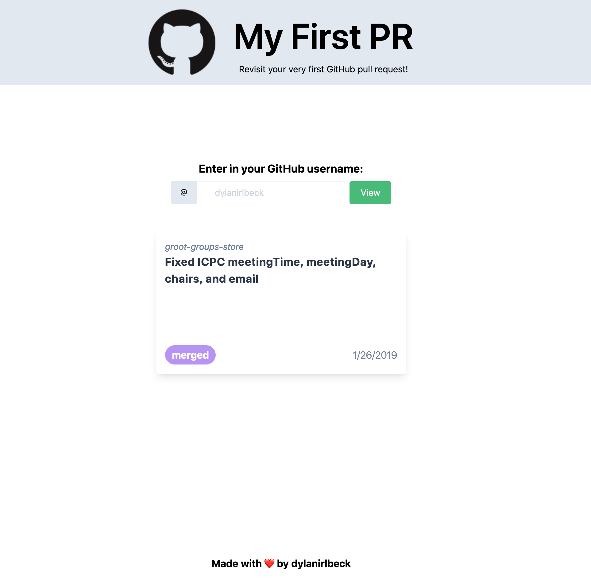

# my-first-pr

Revisit your very first GitHub pull request:
[`my-first-pr.netlify.app`](https://my-first-pr.netlify.app)! See your first
PR's repository, title, opened date, and more, all by entering your username.

## Tools

This project was mainly built as a proof-of-concept of
[`tailwind-ppx`](https://github.com/dylanirlbeck/tailwind-ppx), a ReasonML/OCaml
PPX I wrote to validate your Tailwind classes at compile-time. Turns out, the
PPX worked pretty well (though I'm biased)!

The entire list of tools used in this project:

- [ReasonReact](https://reasonml.github.io/reason-react/)
- [Tailwind CSS](https://tailwindcss.com)
- [`tailwind-ppx`](https://github.com/dylanirlbeck/tailwind-ppx)
- [Create ReasonReact Tailwind](https://github.com/bodhish/create-reason-react-tailwind)

## Contributing

Pull requests and design suggestions are very much welcome! To run the project,
the following commands should be run in separate tabs:

- `yarn re:watch` - Compiles Reason files and watches for changes
- `yarn dev` - Uses Parcel to run the project on `localhost:1234`
